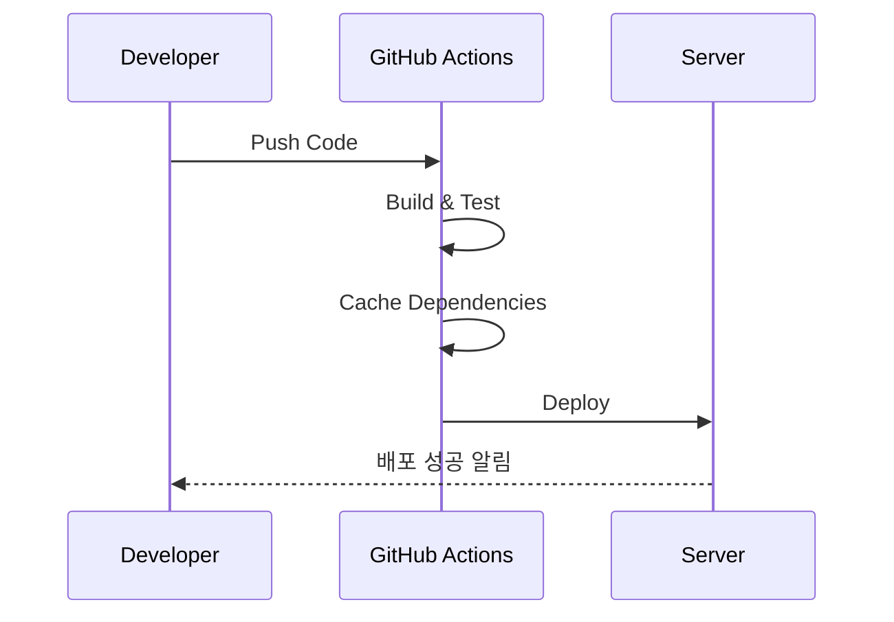

## 문제 상황

- GitHub Actions 빌드 단계에서 **의존성 설치 실패**
- 캐싱이 동작하지 않아 `npm install`이 매번 실행
- 배포 속도 지연 (평균 10분 → 25분)


## 원인 분석

| 원인        | 설명                    |
| --------- | --------------------- |
| 캐시 키 불일치  | OS / Node 버전 mismatch |
| 잘못된 캐시 설정 | `~/.npm` 경로 누락        |
| 네트워크 지연   | 외부 레지스트리 요청 시간 초과 발생  |

---

## 해결 방안

### 1. 캐시 키 수정

```yaml
- name: Cache node modules
  uses: actions/cache@v3
  with:
    path: ~/.npm
    key: ${{ runner.os }}-node-${{ hashFiles('**/package-lock.json') }}
    restore-keys: |
      ${{ runner.os }}-node-
```

### 2. 빌드 & 배포 단계 구분

```yaml
jobs:
  build:
    runs-on: ubuntu-latest
    steps:
      - uses: actions/checkout@v3
      - run: npm ci
      - run: npm run build

  deploy:
    needs: build
    runs-on: ubuntu-latest
    steps:
      - run: echo "Deploying..."
```

### 3. CI/CD 플로우 (Mermaid)



---

## 최종 결과

- 빌드 시간 **25분 → 8분 단축**
- 캐싱 성공률 95% 이상
- 배포 실패율 크게 감소

