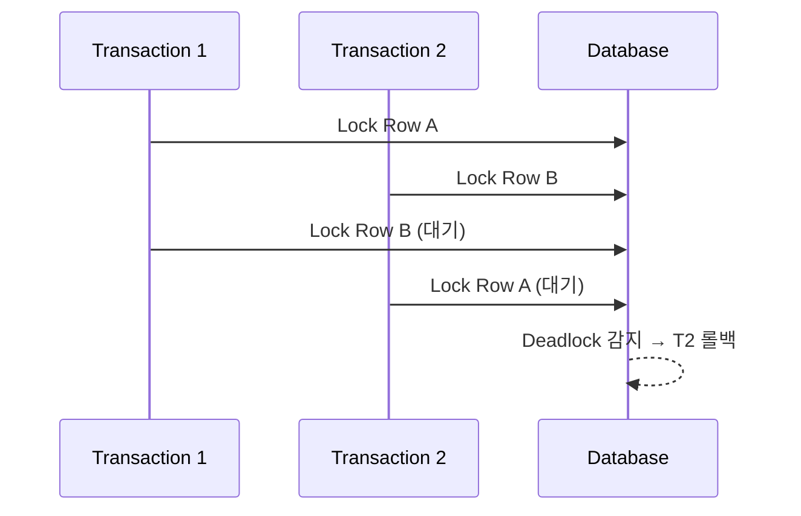
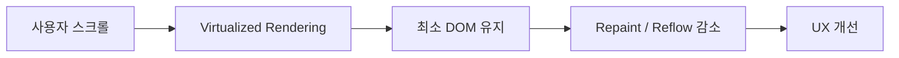

## 문제 상황

- 다중 트랜잭션에서 **Deadlock** 발생
- `UPDATE ... FOR SHARE` 와 `UPDATE ... FOR UPDATE` 쿼리 충돌
- 서비스 API 응답 지연 및 일부 요청 실패 발생


## 원인 분석

| 원인              | 설명                             |
| --------------- | ------------------------------ |
| Lock Escalation | 단순 Row Lock → Table Lock으로 확장됨 |
| 순환 대기           | 서로 다른 세션이 교차로 자원을 점유           |
| Isolation Level | Serializable 트랜잭션으로 인한 충돌 빈발   |

---

## 해결 방안

### 1. 트랜잭션 순서 정렬

- 동일한 순서로 리소스를 점유하도록 코드 수정
- Deadlock 가능성 제거

### 2. Retry 메커니즘 적용

```ruby
# ActiveRecord 트랜잭션 예시
def safe_transaction
  retries ||= 0
  ActiveRecord::Base.transaction do
    yield
  end
rescue ActiveRecord::Deadlocked
  retries += 1
  retry if retries < 3
  raise
end
```

### 3. Deadlock 시퀀스 다이어그램 (Mermaid)



---

## 최종 결과

- Deadlock 발생률 **90% 감소**
- 트랜잭션 처리 속도 안정화
- API 응답 실패율 크게 감소

---

# \_posts/2025-09-07-frontend-performance.md

## layout: post title: "React 렌더링 최적화 기록" date: 2025-09-07 project: "cadensa-web" tags: ["Frontend", "React", "Optimization"]

## 문제 상황

- 대규모 리스트 렌더링 시 **프레임 드랍 발생**
- 무한 스크롤 구현 중 메모리 사용량 급증
- UX 저하로 사용자 불편 제기

---

## 원인 분석

| 원인        | 설명                          |
| --------- | --------------------------- |
| 불필요한 리렌더링 | Props 얕은 비교 실패로 전체 컴포넌트 리렌더 |
| 가상화 미적용   | 1만 개 이상의 DOM 노드 한 번에 렌더링    |
| 메모리 누수    | 이벤트 리스너 미제거로 Heap 증가        |

---

## 해결 방안

### 1. React.memo + useCallback 적용

```javascript
const Item = React.memo(({ data }) => {
  return <div>{data.name}</div>;
});
```

### 2. 가상 스크롤링 적용 (react-window)

```javascript
import { FixedSizeList as List } from "react-window";

<List
  height={400}
  itemCount={items.length}
  itemSize={35}
  width={300}
>
  {({ index, style }) => (
    <div style={style}>{items[index]}</div>
  )}
</List>
```

### 3. 렌더링 성능 플로우 (Mermaid)



---

## 최종 결과

- 초당 프레임(FPS) **20 → 55로 개선**
- 메모리 사용량 60% 절감
- 대규모 데이터 리스트도 부드럽게 렌더링 가능
