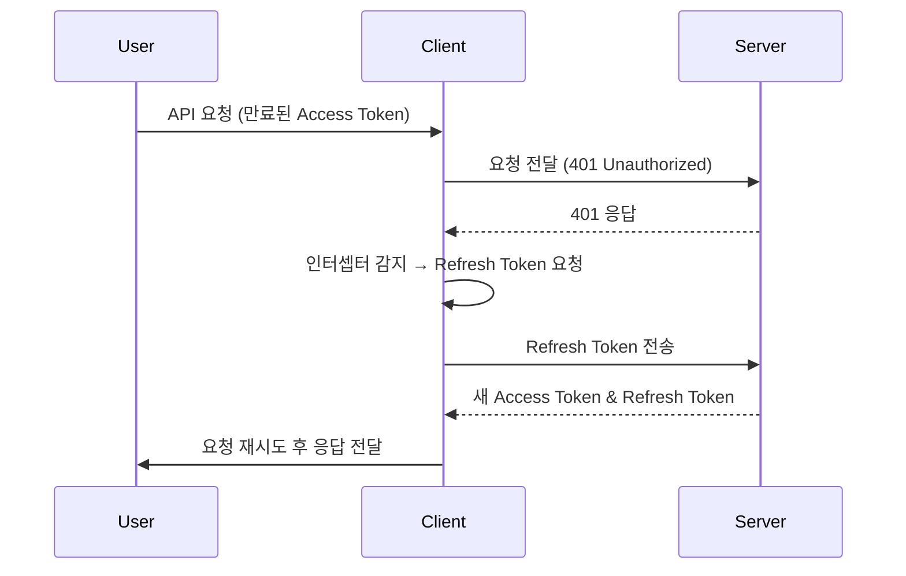
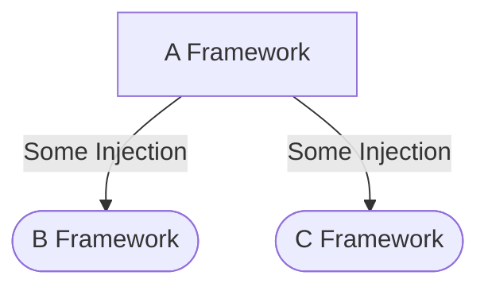

---
# _posts/2025-09-05-my-first-post.md
layout: post
title: "첫 번째 문제 해결 기록"
date: 2025-09-05
project: "cadensa"
tags: ["Authentication", "Rails", "API"]
---

## 문제 상황

* Access Token 만료 후 Refresh Token 재발급 요청이 실패하는 케이스 발생
* Race Condition 으로 인해 동시에 여러 요청이 Refresh Token을 사용
* 사용자가 예기치 않게 로그아웃되는 현상 다수 보고
---

이 포스트는 Jekyll에서 `post.html` 레이아웃을 사용하여 마크다운의 다양한 기능을 테스트합니다.

## 1. 기본 텍스트 서식

이것은 **굵은** 텍스트이고, 이것은 *기울임* 텍스트입니다. `인라인 코드`도 사용할 수 있습니다.

> 이것은 인용문입니다.
> 여러 줄에 걸쳐 작성할 수 있습니다.

## 2. 이미지 렌더링


*Jekyll 로고*

## 3. 표 (Table)

kramdown의 GFM을 사용하여 표를 쉽게 만들 수 있습니다.

| 제목 1 | 제목 2 | 제목 3 |
| :--- | :---: | ---: |
| 왼쪽 정렬 | 가운데 정렬 | 오른쪽 정렬 |
| 내용 A | 내용 B | 내용 C |

## 4. 코드 블록 (Syntax Highlighting)

```python
def hello_world():
    print("Hello, Jekyll!")

hello_world()
```


## 원인 분석

| 원인                | 설명                               |
|-------------------|----------------------------------|
| Race Condition    | Access Token 만료 시점에 동시에 여러 요청 발생 |
| Refresh Token 단일성 | Refresh Token은 한 번 사용 후 무효화      |
| 충돌                | 첫 요청 성공 후 나머지 요청은 무효화된 RT 사용     |


## 해결 방안

### 1. Axios 인터셉터 로직 개선

```javascript
// axios interceptor (예시 코드)
let isRefreshing = false;
let failedQueue = [];

const processQueue = (error, token = null) => {
  failedQueue.forEach(prom => {
    if (error) {
      prom.reject(error);
    } else {
      prom.resolve(token);
    }
  });
  failedQueue = [];
};

axios.interceptors.response.use(
  response => response,
  error => {
    const originalRequest = error.config;

    if (error.response?.status === 401 && !originalRequest._retry) {
      if (isRefreshing) {
        return new Promise((resolve, reject) => {
          failedQueue.push({ resolve, reject });
        })
        .then(token => {
          originalRequest.headers['Authorization'] = `Bearer ${token}`;
          return axios(originalRequest);
        });
      }

      originalRequest._retry = true;
      isRefreshing = true;

      return new Promise((resolve, reject) => {
        axios.post('/auth/refresh')
          .then(({ data }) => {
            axios.defaults.headers.common['Authorization'] = `Bearer ${data.accessToken}`;
            processQueue(null, data.accessToken);
            resolve(axios(originalRequest));
          })
          .catch(err => {
            processQueue(err, null);
            reject(err);
          })
          .finally(() => {
            isRefreshing = false;
          });
      });
    }

    return Promise.reject(error);
  }
);
```

### 2. 토큰 갱신 시퀀스 플로우 (Mermaid)





```python
import os
import matplotlib.image as mpimg
import matplotlib.pyplot as plt
from PIL import Image as im
import numpy as np
import tensorflow as tf
import utills as ut

sess = tf.InteractiveSession()
train_epoch = 1000
# define parameter
class_num = 5
data_length = []
dir_image = []
data = []
label = []
data_shape = [72, 40]
current_pwd = os.getcwd()
for i in range(class_num):
    dir_image.append(ut.search(current_pwd + '\\' + str(i+1)))
    data_length.append(len(dir_image[i]))
    data.append(np.zeros([data_length[i], data_shape[1], data_shape[0]]))
    label.append(np.zeros([data_length[i], class_num]))
    label[i][:,i] = 1
    
# load data
for q in range(class_num):
    for i in range(data_length[q]):
        data[q][i,:,:] = np.mean(im.open(current_pwd + '\\' + str(q+1) + '\\' + dir_image[q][i]), -1)

rawdata = np.concatenate((data[0], data[1], data[2], data[3], data[4]),axis=0)
del data
raw_label = np.concatenate((label[0], label[1], label[2], label[3], label[4]),axis=0)
del label

# under : my code (CJE)

total_data_poin = rawdata.shape[0]
permutation = np.random.permutation(total_data_poin)
rawdata = rawdata[permutation,:,:]
raw_label = raw_label[permutation,:]


# Train/Test용 data, label들을 분류함
Train_data = rawdata[:2000]
Train_label = raw_label[:2000]
Test_data = rawdata[2000:2490]
Test_label = raw_label[2000:2490]

CNNModel, x = ut._CNNModel(72*40)
FlatModel = ut._FlatModel(CNNModel)
DropOut, keep_prob = ut._DropOut(FlatModel)
SoftMaxModel = ut._SoftMax(DropOut)
TrainStep, Accuracy, y_, correct_prediction = ut._SetAccuracy(SoftMaxModel, 5)

sess.run(tf.global_variables_initializer())

for i in range(train_epoch):
  tmp_trainX, tmp_trainY = ut.Nextbatch(Train_data, Train_label, 50)

  #if (i%100 == 0):
  train_accuracy = Accuracy.eval(feed_dict={
        x: tmp_trainX,
        y_: tmp_trainY,
        keep_prob: 1.0})
  print("step %d, training accuracy %g"%(i, train_accuracy))
  TrainStep.run(feed_dict={x: tmp_trainX, y_: tmp_trainY, keep_prob: 0.67})

Test_x = np.asarray(Test_data).reshape(len(Test_data),2880)
Test_y = np.asarray(Test_label)
print("test accuracy %g"%Accuracy.eval(feed_dict={
    x: Test_x, y_: Test_y, keep_prob: 1.0}))

```

### 3. 최종 결과

* 동시에 여러 요청이 들어와도 **하나의 Refresh 요청만** 발생
* 나머지 요청들은 큐에 쌓여 있다가 새로운 Access Token을 공유받음
* 불필요한 로그아웃 현상 제거

사용성 개선 및 안정적인 인증 흐름 확보
